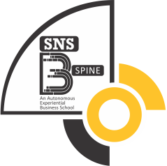

# 🎓 SNS B-SPINE — Experiential Business School

> India's First Design Thinking MBA Programme



---

## 🌟 About

**SNS B-SPINE** is an experiential business school offering a 2-year MBA programme in **Business Analytics**. The programme is built on the foundation of **Design Thinking**, empowering students to become innovative business leaders through real-world problem solving, industry collaboration, and entrepreneurial mindset development.

🔗 **Live Website:** [SNS B-SPINE](https://github.com/Shanmu-iHub/SNS-BSchool)

---

## ✨ Key Highlights

| Feature | Details |
|---|---|
| 🏆 **Unique Approach** | India's First Design Thinking based MBA |
| 💼 **Placement Rate** | 90% placement record |
| 💰 **Highest Package** | 45 LPA |
| 📈 **Internship Stipend** | Up to 3.5 LPA |
| 🤝 **Recruiters** | 20+ top companies |

---

## 🏗️ The 5 Pillars of Excellence

1. **CLT** — Center for Learning and Teaching
2. **SCD** — Skill and Career Development
3. **CFC** — Centre for Creativity
4. **IIPC** — Industry Institute Partnership Cell
5. **SRI** — Social Responsibility Initiatives

---

## 🏠 SPINE Infrastructure

World-class facilities for mental & physical wellbeing:

- 🏊 Swimming Pool
- ⚽ Indoor Pitch
- 🏋️ Fitness Gym
- 🎮 Gaming Center
- 🎬 Mini Theatre
- 🎵 Music Studio
- 💃 Dance Studio
- 🤝 Connection Lounge

---

## 📚 MBA Specializations

- **Marketing** — Branding, Digital Strategy & Market Growth
- **Human Resources** — Talent Management & Organizational Leadership
- **Finance** — Investment, Corporate Finance & Financial Strategy

---

## 🛠️ Tech Stack

| Technology | Usage |
|---|---|
| HTML5 | Structure & Semantics |
| TailwindCSS (CDN) | Styling & Responsive Design |
| JavaScript | Interactivity & Dynamic Content |
| Font Awesome | Icons |
| Google Fonts (Outfit, Inter) | Typography |

---

## 📁 Project Structure

```
SNS-BSchool/
├── index.html          # Main single-page website
├── images/             # All image assets
│   ├── bschool.png     # Logo & Favicon
│   └── ...             # Campus, facility & program images
└── README.md           # Project documentation
```

---

## 🚀 Getting Started

1. **Clone the repository:**
   ```bash
   git clone https://github.com/Shanmu-iHub/SNS-BSchool.git
   ```

2. **Open in browser:**
   ```bash
   open index.html
   ```

   Or simply open `index.html` in any modern web browser.

---

## 📞 Contact

- 📱 **WhatsApp:** [+91 9600940618](https://wa.me/919600940618)
- 📸 **Instagram:** [@snsinstitutions](http://instagram.com/snsinstitutions)

---

## 📄 License

© 2026 SNS B-SPINE. All rights reserved.
